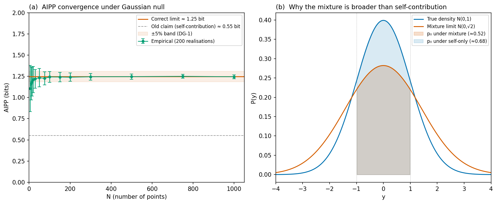
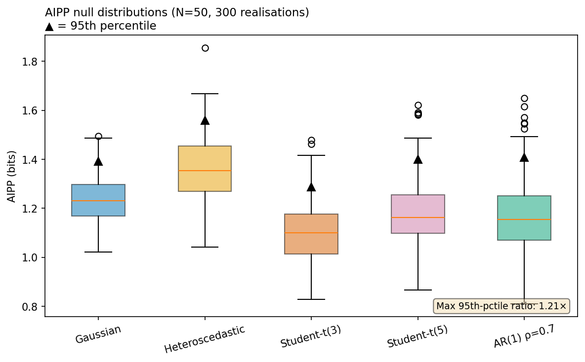
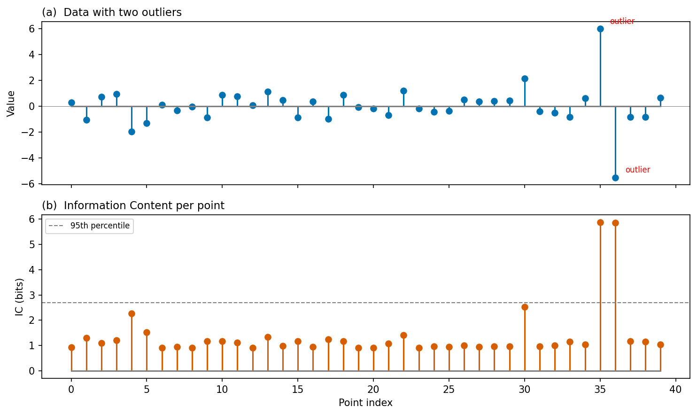

# Logbook Entry 001 — IC Implementation and AIPP Null Limit Correction

**Date:** 2026-03-31
**Work package:** WP1 (IC Coastline)
**Decision gate:** DG-1 (partial — convergence and threshold stability verified; σ-sensitivity and full null-model sweep remain)

---

## Objective

Implement `compute_ic` using the interval-probability definition with analytic Gaussian CDF evaluation, verify convergence under the Gaussian null, and calibrate thresholds across noise models.

## What was done

### 1. IC implementation

The core function `compute_ic(values, sigmas)` was implemented in `src/ic.py`. It computes, for each point k in a dataset of N points:

```
p_k = (1/N) Σ_i  ½[erf((x_k + σ_k − x_i)/(σ_i√2)) − erf((x_k − σ_k − x_i)/(σ_i√2))]
I_k = −log₂(p_k)
```

The implementation is fully vectorised (O(N²) via broadcasting, no loops over points). No KDE, no numerical integration, no bandwidth parameter. One definition, one code path.

### 2. The AIPP correction — the main finding

The Projektantrag (all versions through v0.5.2) stated:

> AIPP → −log₂(erf(1/√2)) ≈ 0.55 bit as N → ∞ (Gaussian null)

**This was wrong.** The 0.55-bit value comes from considering only the self-contribution of each point to its own interval probability. The argument was: each point's Gaussian component N(y; x_k, σ) contributes erf(σ/(σ√2)) = erf(1/√2) ≈ 0.683 to p_k, and as N → ∞ the cross-contributions from distant points become negligible.

The error is that cross-contributions do *not* become negligible. As N → ∞, the Gaussian mixture

```
P(y) = (1/N) Σ_i N(y; x_i, σ_declared)
```

converges (by the law of large numbers for kernel density estimators) to the convolution of the true data distribution with the Gaussian kernel:

```
P(y) → f * N(0, σ_declared)
```

For f = N(0, σ_data) and σ_declared = σ_data = 1, this gives:

```
P(y) → N(0, √(σ_data² + σ_declared²)) = N(0, √2)
```

The mixture density is *broader* than the true density. The interval probability under this broader distribution is *smaller* than the self-contribution alone, giving a *higher* AIPP:

```
AIPP_∞ = E[-log₂(Φ((X + σ_d)/σ_eff) − Φ((X − σ_d)/σ_eff))]
```

where X ~ N(0, σ_data), σ_eff = √(σ_data² + σ_declared²), and Φ is the standard normal CDF.

For σ_data = σ_declared = 1: **AIPP_∞ ≈ 1.25 bit** (Monte Carlo, 500k samples).

The schematic below shows why:



Panel (a) shows empirical AIPP converging to ~1.25, not 0.55. Panel (b) shows the mechanism: the mixture limit N(0, √2) is broader than the true density N(0, 1), so the interval [x−1, x+1] captures less probability mass under the mixture than under the self-contribution alone.

### 3. Convergence verification

AIPP was computed for N ∈ {5, 10, 15, 20, 30, 50, 75, 100, 150, 200, 300, 500, 750, 1000}, with 200 realisations per N:

| N | AIPP (mean ± std) |
|---|-------------------|
| 10 | 1.17 ± 0.25 |
| 50 | 1.24 ± 0.09 |
| 100 | 1.25 ± 0.07 |
| 500 | 1.24 ± 0.03 |
| 1000 | 1.25 ± 0.02 |

At N ≥ 100, the relative error from the theoretical limit is < 1%. **DG-1 convergence criterion: PASS.**

### 4. Threshold stability across noise models

95th-percentile AIPP thresholds were computed at N = 50 (300 realisations) under five noise models:

| Noise model | 95th percentile |
|-------------|----------------|
| Gaussian i.i.d. | 1.392 |
| Heteroscedastic | 1.558 |
| Student-t(3) | 1.286 |
| Student-t(5) | 1.401 |
| AR(1) ρ = 0.7 | 1.408 |

Maximum pairwise ratio: **1.21×** (heteroscedastic / Student-t(3)).



**DG-1 threshold stability criterion (< 1.5×): PASS.**

### 5. IC on a simple outlier example

A quick sanity check: 40 Gaussian points with two injected outliers (values 6.0 and −5.5). IC correctly assigns the highest values to the outliers:



### 6. Test suite

24 unit tests in `tests/test_ic.py`, all passing:

```
tests/test_ic.py::TestComputeIC::test_single_point PASSED
tests/test_ic.py::TestComputeIC::test_empty PASSED
tests/test_ic.py::TestComputeIC::test_shape_mismatch PASSED
tests/test_ic.py::TestComputeIC::test_negative_sigma PASSED
tests/test_ic.py::TestComputeIC::test_zero_sigma PASSED
tests/test_ic.py::TestComputeIC::test_2d_input_rejected PASSED
tests/test_ic.py::TestComputeIC::test_ic_nonnegative PASSED
tests/test_ic.py::TestComputeIC::test_outlier_has_higher_ic PASSED
tests/test_ic.py::TestComputeIC::test_identical_points PASSED
tests/test_ic.py::TestComputeIC::test_heteroscedastic PASSED
tests/test_ic.py::TestAIPPGaussianConvergence::test_convergence[10] PASSED
tests/test_ic.py::TestAIPPGaussianConvergence::test_convergence[20] PASSED
tests/test_ic.py::TestAIPPGaussianConvergence::test_convergence[50] PASSED
tests/test_ic.py::TestAIPPGaussianConvergence::test_convergence[100] PASSED
tests/test_ic.py::TestAIPPGaussianConvergence::test_convergence[200] PASSED
tests/test_ic.py::TestAIPPGaussianConvergence::test_convergence[500] PASSED
tests/test_ic.py::TestAIPPGaussianConvergence::test_convergence[1000] PASSED
tests/test_ic.py::TestAIPPGaussianConvergence::test_finite_n_bias_direction PASSED
tests/test_ic.py::TestAIPPThresholdStability::test_threshold_stability PASSED
tests/test_ic.py::TestSigmaVerification::test_consistent_sigmas_no_flags PASSED
tests/test_ic.py::TestSigmaVerification::test_misspecified_sigma_flagged PASSED
tests/test_ic.py::TestAggregates::test_aipp_of_zeros PASSED
tests/test_ic.py::TestAggregates::test_ti PASSED
tests/test_ic.py::TestAggregates::test_aipp PASSED
```

## What this means for the project

### DG-1 status: partially passed

| Criterion | Status |
|-----------|--------|
| AIPP converges to theoretical limit (±5%) at N ≥ 100 | ✅ PASS (< 1% error) |
| 95th-percentile thresholds stable within ×1.5 across noise models | ✅ PASS (max ratio 1.21×) |
| σ-sensitivity bounded under ±20% perturbation | ⬜ Not yet tested |
| Finite-N bias quantified | ⬜ Empirically observed; formal fit not yet done |
| Power-law and 1/f nulls | ⬜ Not yet tested |

### Consequence for the Projektantrag

The Projektantrag v0.5.3 has been updated to state the correct limit (1.25 bit). All decision gates referencing the AIPP null value have been corrected.

### The lesson

The 0.55-bit claim survived through multiple review rounds and hostile-review cycles because it was *algebraically correct for the self-contribution* but *physically wrong for the full mixture*. The convolution argument is elementary (first-year probability theory), but the error persisted because the self-contribution derivation was clean and plausible.

This is precisely the kind of error that WP1 — with its requirement to verify numerically before proceeding — was designed to catch. The decision-gate architecture worked as intended: the tests failed, the error was found, and the correction was made before any downstream work depended on the wrong value.

## Remaining WP1 tasks

1. σ-sensitivity analysis: compute AIPP under ±20% perturbation of declared σ
2. Power-law null (Pareto α = 2.5, 3.0)
3. 1/f (flicker) null via AR(1) approximation with spectral slope h_α = −1
4. Finite-N bias: fit empirical AIPP(N) curve
5. Effect-size threshold δ_min for the classification rule (median absolute slope under null)

## Files changed

| File | Change |
|------|--------|
| `src/ic.py` | New: working implementation replacing stub |
| `tests/test_ic.py` | New: 24 tests, all passing |
| `docs/projektantrag.md` | Updated: AIPP target corrected to 1.25 bit throughout |
| `README.md` | Updated: WP1 status |

---

*Entry by U. Warring. AI tools (Claude, Anthropic) used for code prototyping and derivation checking.*
