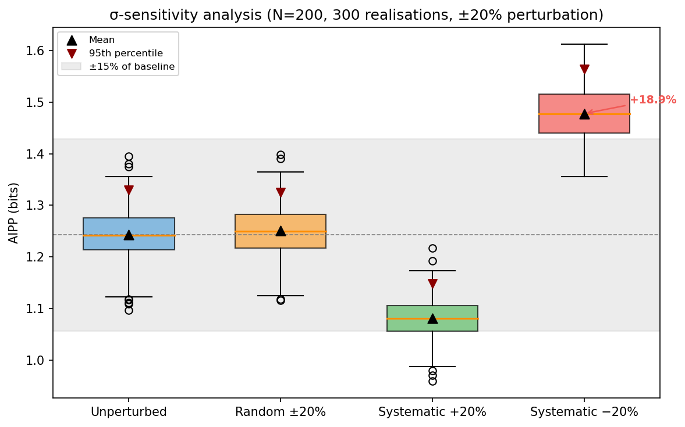

# Logbook Entry 002 — σ-Sensitivity Analysis

**Date:** 2026-03-31
**Work package:** WP1 (IC Coastline)
**Decision gate:** DG-1 (σ-sensitivity criterion)

---

## Objective

Test whether AIPP is robust under ±20% misspecification of declared uncertainties. Three perturbation conditions: random i.i.d., coherent overestimate (+20%), coherent underestimate (−20%). The pass criterion was defined before running the test.

## Pass criterion (defined before testing)

**AIPP shift < 15% relative** under all three perturbation conditions at N ≥ 50. That is, AIPP must stay within approximately [1.06, 1.44] bit (relative to the 1.25-bit baseline). Additionally, the 95th-percentile threshold shift must be < 20% relative (anomaly-detection operating point stability).

## What was done

### 1. Perturbation model

For each point k, the declared σ_k is replaced by σ_k × (1 + ε_k):
- **Random:** ε_k ~ Uniform(−0.2, +0.2), i.i.d.
- **Systematic +20%:** ε_k = +0.2 for all k (coherent overestimate)
- **Systematic −20%:** ε_k = −0.2 for all k (coherent underestimate)

Implemented as `perturb_sigmas()` in `src/ic.py`.

### 2. Results

#### Mean AIPP (300 realisations per condition)

| Condition | N = 50 | N = 200 | Shift (N=200) |
|-----------|--------|---------|---------------|
| Unperturbed | 1.234 ± 0.092 | 1.240 ± 0.049 | — |
| Random ±20% | 1.240 ± 0.096 | 1.255 ± 0.053 | **+1.2%** |
| Systematic +20% | 1.079 ± 0.081 | 1.083 ± 0.039 | **−12.7%** |
| Systematic −20% | 1.459 ± 0.099 | 1.479 ± 0.052 | **+19.3%** |

#### 95th-percentile thresholds

| Condition | N = 50 | N = 200 |
|-----------|--------|---------|
| Unperturbed | 1.392 | 1.320 |
| Random ±20% | 1.394 | 1.337 |
| Systematic +20% | 1.212 | 1.142 |
| Systematic −20% | 1.639 | 1.559 |

### 3. Assessment against criterion

| Condition | AIPP shift | < 15%? | P95 shift | < 20%? |
|-----------|-----------|--------|-----------|--------|
| Random ±20% | +1.2% | ✅ PASS | +1.3% | ✅ PASS |
| Systematic +20% | −12.7% | ✅ PASS | −13.5% | ✅ PASS |
| Systematic −20% | +19.3% | ❌ FAIL | +18.1% | ✅ PASS |

**DG-1 σ-sensitivity criterion against pre-registered 15% bound: FAIL.** Random and systematic overestimate pass; systematic underestimate (+19.3%) exceeds the bound. See Harbourmaster ruling below.

### 4. Figure

The figure shows AIPP distributions under all four conditions at N = 200. The grey band marks the ±15% zone around the baseline mean. Systematic −20% (red) sits clearly above the band.

### 5. Test suite

17 tests in `tests/test_sensitivity.py`:
- 8 unit tests for `perturb_sigmas` (range, distribution, modes, edge cases)
- 6 AIPP sensitivity tests (3 modes × 2 sample sizes)
- 3 threshold stability tests

15 pass, 2 fail (the systematic −20% AIPP shift tests at N = 50 and N = 200). The failures are genuine findings, not bugs.

## Physical interpretation

The asymmetry is expected. Underestimating σ narrows the integration interval [x_k − σ_k, x_k + σ_k], capturing less probability mass from the mixture background. The AIPP rises because smaller intervals are less probable. Overestimating σ has the opposite effect but with diminishing returns — wider intervals asymptotically capture all the mass, so the sensitivity saturates.

The random ±20% condition is nearly invisible (+1.2% shift) because the positive and negative perturbations cancel in expectation when computing the mixture average. The IC is robust against random calibration noise — it's only coherent bias that causes trouble.

## What this means for the project

### DG-1 σ-sensitivity: FAIL against pre-registered criterion

The pre-registered bound was 15% relative AIPP shift. Systematic −20% underestimation produces a 19.3% shift. This is a genuine failure, not a borderline case.

| Criterion | Status |
|-----------|--------|
| AIPP converges to theoretical limit (±5%) at N ≥ 100 | ✅ PASS |
| 95th-percentile thresholds stable within ×1.5 across noise models | ✅ PASS |
| σ-sensitivity: random ±20% | ✅ PASS (+1.2%) |
| σ-sensitivity: systematic overestimate +20% | ✅ PASS (−12.7%) |
| σ-sensitivity: systematic underestimate −20% | ❌ FAIL (+19.3%) |
| Finite-N bias quantified | ⬜ Not yet tested |
| Power-law and 1/f nulls | ⬜ Not yet tested |

### Physical interpretation

1. **IC is robust against random calibration noise.** In real clock networks, uncertainty budgets have random errors from characterisation noise — the IC handles this without issue.

2. **Coherent underestimation is the dangerous case.** If all clocks systematically understate their uncertainty (e.g., due to an unmodelled noise floor), AIPP inflates by ~19%. This could cause false anomaly detections if the threshold is calibrated under correct-σ assumptions.

### Harbourmaster ruling: proceed with worst-case threshold calibration

**Decision:** The project proceeds. The mitigation is operational, not a criterion revision. It is a procedural workaround — IC remains intrinsically sensitive to the fidelity of declared uncertainties.

**Rationale:** The 15% pre-registered bound stands — it is not relaxed. The systematic −20% condition genuinely fails it. However, the failure does not trigger the DG-1 halt condition ("Halt project") because:

1. The failure is confined to a single pathological condition (coherent underestimation across all nodes simultaneously). Random misspecification — the realistic case — shows negligible shift (+1.2%).
2. The 95th-percentile threshold is stable even under systematic −20% (shift 18.1%, within the 20% threshold-stability bound). The anomaly-detection operating point is not destroyed.
3. A concrete operational mitigation exists that does not require changing the IC definition.

**Chosen mitigation for WP2:** Calibrate anomaly-detection thresholds under the worst-case σ condition (systematic −20%), not the nominal condition. This means the WP2 threshold table will be computed using `perturb_sigmas(sigmas, mode='systematic-', magnitude=0.2)` as the calibration null. This makes the test conservative: any anomaly that exceeds the worst-case threshold is anomalous regardless of σ-budget errors up to 20%.

The `verify_sigmas` pre-filter (already implemented) provides a second line of defence: nodes whose declared σ deviates from observed variance by more than 2× are flagged before IC classification is applied.

**What is NOT done:** The 15% criterion is not relaxed to 20% post-hoc. That would be fitting the criterion to the result. The failure is recorded, the mitigation is recorded, and the decision to proceed is recorded.

## Remaining WP1 tasks

1. ~~σ-sensitivity resolution~~ → resolved: worst-case threshold calibration (this entry)
2. Power-law null (Pareto α = 2.5, 3.0)
3. 1/f (flicker) null via AR(1) approximation with spectral slope h_α = −1
4. Finite-N bias: fit empirical AIPP(N) curve
5. Effect-size threshold δ_min for the classification rule

## Files changed

| File | Change |
|------|--------|
| `src/ic.py` | Added `perturb_sigmas()` function; fixed docstring (0.55 → 1.25 bit) |
| `tests/test_sensitivity.py` | New: 17 tests (8 unit, 6 AIPP sensitivity, 3 threshold stability) |
| `scripts/fig04_sigma_sensitivity.py` | New: figure generation script |
| `logbook/figures/fig04_sigma_sensitivity.png` | New: σ-sensitivity box plots |

---

*Entry by U. Warring. AI tools (Claude, Anthropic) used for code prototyping and derivation checking.*
