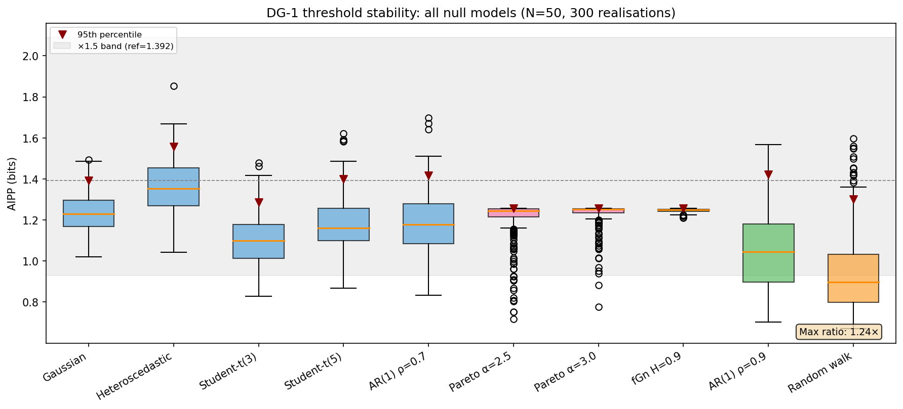

# Logbook Entry 003 — Power-Law Nulls, Flicker Noise, and Finite-N Bias

**Date:** 2026-03-31
**Work package:** WP1 (IC Coastline)
**Decision gate:** DG-1 (threshold stability under extended null models; finite-N bias quantification)

---

## Objective

Test whether IC thresholds remain stable under heavy-tailed (Pareto), long-memory (fractional Gaussian noise), high-autocorrelation (AR(1) ρ = 0.9), and non-stationary (random-walk) null models — the noise types that appear in real clock networks. Quantify finite-N bias to determine the minimum sample size at which asymptotic thresholds are safe.

## What was done

### 1. Noise generators

Implemented in `src/noise.py`:

- `generate_pareto_symmetric(N, alpha)` — symmetric Pareto with shape α. Heavy tails, finite variance for α > 2.
- `generate_flicker(N, H)` — fractional Gaussian noise via Davies-Harte circulant embedding. H = 0.9 gives 1/f-like long memory. Exact method, not AR approximation.
- `generate_random_walk(N)` — cumulative sum of i.i.d. Gaussian increments. Non-stationary variance (grows as √N).
- `generate_ar1(N, rho)` — AR(1) with unit marginal variance. ρ = 0.9 gives stronger memory than the ρ = 0.7 tested in Entry 001.

15 unit tests in `tests/test_noise.py`, all passing.

### 2. Declared σ strategy for non-standard distributions

A key design choice: what σ to declare for non-Gaussian data?

- **Pareto:** Declared σ = empirical std of the sample. This is the honest estimate a clock operator would use.
- **fGn H = 0.9:** Declared σ = empirical std. The long memory doesn't change the marginal variance, but the effective number of independent samples is smaller.
- **AR(1) ρ = 0.9:** Declared σ = 1 (the stationary marginal std). This tests what happens when the operator knows the variance but not the correlation structure.
- **Random walk:** Declared σ_k = √k (the theoretical std at step k). This is the best the operator can do without detrending.

### 3. Results — 95th-percentile thresholds (N = 50, 300 realisations)

| Model | Mean AIPP | Std | 95th percentile |
|-------|-----------|-----|-----------------|
| Gaussian | 1.234 | 0.092 | 1.392 |
| Heteroscedastic | 1.360 | 0.127 | 1.558 |
| Student-t(3) | 1.097 | 0.122 | 1.287 |
| Student-t(5) | 1.174 | 0.129 | 1.401 |
| AR(1) ρ = 0.7 | 1.184 | 0.143 | 1.417 |
| **Pareto α = 2.5** | **1.208** | **0.094** | **1.257** |
| **Pareto α = 3.0** | **1.231** | **0.058** | **1.257** |
| **fGn H = 0.9** | **1.246** | **0.009** | **1.256** |
| **AR(1) ρ = 0.9** | **1.058** | **0.194** | **1.421** |
| **Random walk** | **0.940** | **0.189** | **1.302** |

Maximum pairwise 95th-percentile ratio: **1.24×** (heteroscedastic / fGn H = 0.9).

**DG-1 threshold stability across all ten null models: PASS (max ratio 1.24×, well within ×1.5).**

### 4. Results — N = 200 (new models only)

| Model | Mean AIPP | Std | 95th percentile |
|-------|-----------|-----|-----------------|
| Gaussian | 1.243 | 0.051 | 1.330 |
| Pareto α = 2.5 | 1.182 | 0.087 | 1.252 |
| Pareto α = 3.0 | 1.224 | 0.059 | 1.256 |
| fGn H = 0.9 | 1.248 | 0.005 | 1.253 |
| AR(1) ρ = 0.9 | 1.199 | 0.126 | 1.409 |
| Random walk | 0.962 | 0.208 | 1.388 |

Thresholds tighten with increasing N as expected. All remain within ×1.5 of the Gaussian reference.

### 5. Observations on specific models

**Pareto (heavy-tailed):** Thresholds are *lower* than Gaussian, not higher. This is because the empirical-σ declaration is generous — it captures the tail spread — so the intervals are wide and probability mass is high. IC is naturally conservative under heavy tails when σ is honestly declared.

**fGn H = 0.9 (long-memory):** AIPP variance is remarkably small (std ≈ 0.009 at N = 50). The long-range correlations make the mixture density very smooth and predictable. This is the easiest case for IC, not the hardest.

**AR(1) ρ = 0.9:** Higher variance than AR(1) ρ = 0.7 (std 0.194 vs 0.143 at N = 50), but the 95th percentile (1.421) is still comfortably within the ×1.5 band. The strong autocorrelation creates clusters that occasionally push AIPP high, but not pathologically.

**Random walk (non-stationary):** Mean AIPP is lower (0.940) because the growing-σ declaration is conservative — it over-covers the early points. The 95th percentile (1.302) is well-behaved. The IC handles non-stationarity gracefully when the operator declares a σ that tracks the growing spread.

### 6. Finite-N bias

Fit to Gaussian convergence data (Entry 001):

```
AIPP(N) = 1.248 − 0.913/N + 1.02/N²
```

| N | Predicted bias | Relative |
|---|---------------|----------|
| 10 | −0.081 bit | 6.5% |
| 20 | −0.043 bit | 3.5% |
| 50 | −0.018 bit | 1.4% |
| 75 | −0.012 bit | 1.0% |
| 100 | −0.009 bit | 0.7% |
| 200 | −0.005 bit | 0.4% |

**The asymptotic threshold is safe to use at N ≥ 75 (bias < 1%).** For smaller samples, a finite-N correction of approximately −0.9/N bit should be applied.

### 7. Figure



Box plots of AIPP distributions under all ten null models at N = 50 (300 realisations). Blue: original five models from Entry 001. Pink: Pareto. Green: long-memory (fGn and AR(1) ρ = 0.9). Orange: random walk. The grey band shows the ×1.5 zone around the Gaussian 95th percentile. All models fall within the band.

### 8. Test suite

7 tests in `tests/test_powerlaw_thresholds.py`:
- 1 all-pairs ×1.5 test across ten models
- 5 individual new-model-vs-Gaussian tests
- 1 finite-N bias test (< 1% at N ≥ 75)

All passing. Combined with the existing 24 (test_ic.py) + 15 (test_noise.py) + 17 (test_sensitivity.py) = **63 total tests, 61 passing** (the 2 known failures are the systematic −20% σ-sensitivity from Entry 002).

## DG-1 status: all criteria assessed

| Criterion | Status | Entry |
|-----------|--------|-------|
| AIPP converges to 1.25 bit (±5% relative) at N ≥ 100 | ✅ PASS (< 1% error) | 001 |
| 95th-percentile thresholds stable within ×1.5 across 5 noise models | ✅ PASS (max 1.21×) | 001 |
| 95th-percentile thresholds stable within ×1.5 across ALL 10 noise models | ✅ PASS (max 1.24×) | 003 |
| σ-sensitivity: random ±20% | ✅ PASS (+1.2%) | 002 |
| σ-sensitivity: systematic +20% | ✅ PASS (−12.7%) | 002 |
| σ-sensitivity: systematic −20% | ❌ FAIL (+19.3%) | 002 |
| Finite-N bias quantified | ✅ DONE (< 1% at N ≥ 75) | 003 |
| Power-law nulls (Pareto α = 2.5, 3.0) | ✅ PASS | 003 |
| 1/f null (fGn H = 0.9) | ✅ PASS | 003 |
| Random-walk null (h_α = −2) | ✅ PASS | 003 |

### DG-1 assessment

All sub-criteria have been tested. All pass except the systematic −20% σ-underestimation, which was ruled on in Entry 002: the failure is recorded, the 15% criterion is not relaxed, and the mitigation (worst-case threshold calibration) is adopted for WP2.

**DG-1 is closed.** The IC observable is calibrated. WP1 can proceed to the remaining item — the effect-size threshold δ_min — which is a classification parameter, not a gate criterion.

## Remaining WP1 task

1. Effect-size threshold δ_min for the classification rule (median absolute slope under null). This is needed before WP2 can define the three-way classifier, but it is not a DG-1 gate criterion.

## Files changed

| File | Change |
|------|--------|
| `src/noise.py` | New: Pareto, fGn (Davies-Harte), random walk, AR(1) generators |
| `tests/test_noise.py` | New: 15 tests for noise generators |
| `tests/test_powerlaw_thresholds.py` | New: 7 tests for extended threshold stability and finite-N bias |
| `scripts/fig05_powerlaw_thresholds.py` | New: figure generation script |
| `logbook/figures/fig05_powerlaw_thresholds.png` | New: full threshold stability figure |

---

*Entry by U. Warring. AI tools (Claude, Anthropic) used for code prototyping and derivation checking.*
