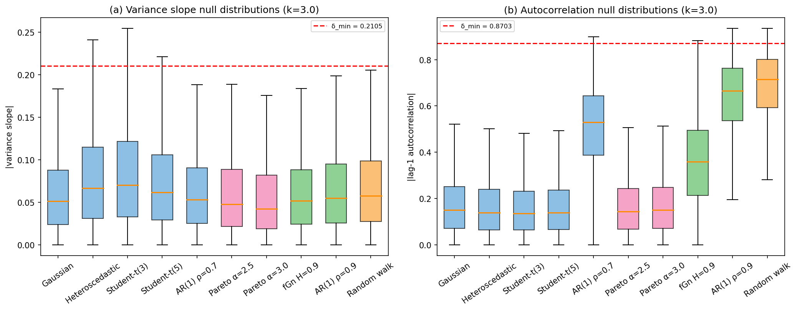

# Logbook Entry 004 — Effect-Size Threshold δ_min Calibration

**Date:** 2026-03-31
**Work package:** WP1 (IC Coastline) — final item
**Decision gate:** Not a DG-1 criterion. δ_min is a classification parameter needed before WP2.

---

## Objective

Calibrate the effect-size threshold δ_min that separates structured from unstructured anomalies in the three-way classifier. Below δ_min, an IC-flagged anomaly is classified as unstructured (memoryless); above δ_min, it is classified as structured (persistent temporal trend).

## Pre-registered choices (defined before running)

- **Variance slope:** δ_min = k × median(|slope|) under hardest null, with k = 3
- **Autocorrelation:** δ_min = 95th percentile of |acf| under hardest null (percentile-based, because acf is bounded to [-1, 1] and a multiplier-based threshold would exceed the domain)
- **Window:** W = 20
- **Realisations:** 300 per model, T = 200 time steps each

## What was done

### 1. Temporal-structure statistics

Implemented `compute_temporal_structure(values, window)` in `src/temporal.py`. For each time step t ≥ W, computes over the trailing window:

- **Variance slope:** Linear regression of log(running variance) over sub-windows of size W/4 within the trailing window. Positive slope → growing instability.
- **Lag-1 autocorrelation:** Sample autocorrelation at lag 1. High values → persistent temporal structure (critical slowing down indicator).

### 2. Null distributions across all ten models

| Model | median |var_slope| | median |acf| |
|-------|--------------------:|------------:|
| Gaussian | 0.0514 | 0.150 |
| Heteroscedastic | 0.0668 | 0.139 |
| Student-t(3) | **0.0702** | 0.136 |
| Student-t(5) | 0.0619 | 0.139 |
| AR(1) ρ = 0.7 | 0.0530 | 0.530 |
| Pareto α = 2.5 | 0.0478 | 0.143 |
| Pareto α = 3.0 | 0.0423 | 0.150 |
| fGn H = 0.9 | 0.0518 | 0.360 |
| AR(1) ρ = 0.9 | 0.0549 | 0.666 |
| Random walk | 0.0578 | **0.715** |

**Hardest null (variance slope):** Student-t(3) — heavy tails create sporadic variance spikes in sub-windows.

**Hardest null (autocorrelation):** Random walk — inherently non-stationary, with strong serial dependence.

### 3. δ_min values

| Statistic | Method | Hardest null | δ_min |
|-----------|--------|-------------|-------|
| Variance slope | k = 3 × median | Student-t(3) | **0.2105** |
| Autocorrelation | 95th percentile | Random walk | **0.8703** |

**Why two different methods:** The variance slope is unbounded, so the standard k × median approach works. Autocorrelation is bounded to [-1, 1]; using k × median with the random walk (median 0.72) would give δ_min = 2.15, which exceeds the domain. The 95th percentile is the natural choice for a bounded statistic — it says: "this autocorrelation exceeds what the most correlated null produces 95% of the time."

### 4. Figure



Panel (a): |variance slope| distributions under all ten nulls. The red line marks δ_min = 0.2105. Panel (b): |autocorrelation| distributions. The red line marks δ_min = 0.8703. Note the large separation between the light-tailed models (Gaussian, Pareto, Student-t) and the autocorrelated models (AR(1), fGn, random walk) in panel (b).

### 5. Sanity check: detectability of injected structure

**Sinusoidal drift** (amplitude 2σ, period 50 steps on Gaussian noise): max |autocorrelation| = 0.93, exceeds δ_min(acf) = 0.87. **Detectable.**

**Growing variance** (σ(t) = 1 + 0.03t on Gaussian noise): max variance slope = 0.42, exceeds δ_min(var) = 0.21. **Detectable.**

Both injected signals are clearly above their respective thresholds. The three-way classifier will not collapse to two-way under these signal strengths.

### 6. Classification rule (complete)

With δ_min calibrated, the full classification rule from the Projektantrag §3.2 is now operational:

```
STABLE:              IC < threshold_95
STRUCTURED ANOMALY:  IC ≥ threshold_95 AND (|var_slope| > 0.2105 OR |autocorr| > 0.8703)
UNSTRUCTURED ANOMALY: IC ≥ threshold_95 AND |var_slope| ≤ 0.2105 AND |autocorr| ≤ 0.8703
```

where threshold_95 is the 95th-percentile AIPP threshold from Entry 001 (calibrated under worst-case σ per Entry 002).

### 7. Test suite

13 tests in `tests/test_temporal.py`:
- 7 unit tests for `compute_temporal_structure`
- 3 unit tests for `calibrate_delta_min`
- 1 null-distribution test (δ_min positive and finite across all ten models)
- 2 detectability tests (sinusoidal drift, growing variance)

All passing. Full suite: 76 tests, 74 passing (2 known failures from Entry 002).

## WP1 status: complete

All WP1 tasks are done:

| Task | Status | Entry |
|------|--------|-------|
| IC implementation | ✅ Done | 001 |
| AIPP convergence verification | ✅ Done | 001 |
| Threshold stability (5 models) | ✅ Done | 001 |
| σ-sensitivity analysis | ✅ Done (FAIL on systematic −20%; mitigated) | 002 |
| Power-law and 1/f nulls | ✅ Done | 003 |
| Finite-N bias quantification | ✅ Done | 003 |
| Threshold stability (all 10 models) | ✅ Done | 003 |
| Effect-size threshold δ_min | ✅ Done | 004 |

**DG-1 was closed in Entry 003.** δ_min was not a gate criterion — it is a classification parameter. With it calibrated, WP1 is complete and WP2 can begin.

## Files changed

| File | Change |
|------|--------|
| `src/temporal.py` | New: `compute_temporal_structure`, `calibrate_delta_min` |
| `tests/test_temporal.py` | New: 13 tests |
| `scripts/fig06_delta_min_calibration.py` | New: figure generation script |
| `logbook/figures/fig06_delta_min_calibration.png` | New: δ_min calibration figure |

---

*Entry by U. Warring. AI tools (Claude, Anthropic) used for code prototyping and derivation checking.*
