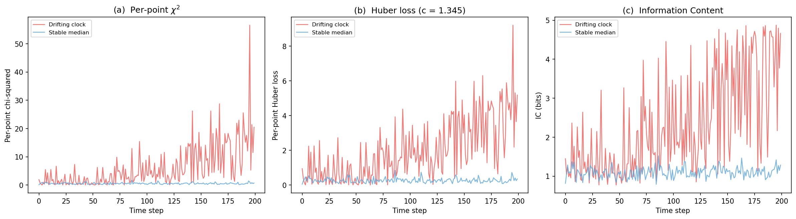

# Logbook Entry 005 — Positioning IC Against Established Figures of Merit

**Date:** 2026-04-01
**Work package:** WP1 addendum (post DG-1 closure)
**Trigger:** External review requested explicit positioning of IC relative to standard figures of merit.
**Decision gate:** Does not modify DG-1 ruling.

---

## Objective

Clarify what IC is and is not, by comparing it side-by-side with three established figures of merit: per-point χ² (squared normalised residual), Huber loss, and Allan deviation.

This is a positioning exercise, not a performance benchmark. IC was not designed to replace any of these measures; its role in the project is to separate detection (is this point anomalous?) from interpretation (is the anomaly structured or unstructured?).

## Comparison functions

Three functions implemented in `src/comparison.py`:

| Function | Definition | What it measures |
|----------|-----------|-----------------|
| `compute_chi2(values, sigmas)` | (x_k / σ_k)² | Per-point squared normalised residual |
| `compute_huber(values, sigmas, c)` | ρ_c(u) = u²/2 if \|u\| ≤ c, c\|u\| − c²/2 otherwise | Per-point Huber loss (bounded influence) |
| `compute_allan_deviation(values, taus)` | Overlapping Allan deviation | Temporal frequency stability |

Note: `compute_chi2` returns the per-point squared normalised residual, not the summed χ² test statistic. `compute_allan_deviation` is a temporal stability measure — structurally different from the other three, which are all pointwise scores.

## Controlled example

**Setup:** 20 clocks, T = 200 steps, seed `np.random.default_rng(2026)`.

- 19 stable clocks: Gaussian noise, σ = 1.
- 1 drifting clock (index 0): Gaussian noise σ = 1 plus linear drift of 0.02 per step.

At each time step, χ², Huber, and IC are computed across all 20 clocks.

### Results (last 50 steps)

| Metric | Drifting clock (mean) | Stable median (mean) | Ratio |
|--------|---------------------:|--------------------:|------:|
| χ² | 13.20 | 0.52 | 25.2× |
| Huber | 3.68 | 0.26 | 14.0× |
| IC | 3.51 | 1.11 | 3.2× |

The ratios reflect how each measure responds to a growing signal:

- **χ²** amplifies the drift quadratically — a 4σ residual contributes 16× more than a 1σ residual. High sensitivity but also high tail sensitivity.
- **Huber** grows linearly beyond its threshold (c = 1.345), bounding the influence of large residuals. The ratio is still large because the drift grows steadily.
- **IC** responds logarithmically through the probability transform. The ratio is moderate — IC compresses extreme values through the log. This is a feature, not a limitation: IC does not need to amplify large residuals because its downstream role is binary classification (anomalous vs not), not magnitude estimation.

## Figure

Panel (a): Per-point χ² for the drifting clock (red) vs median of stable clocks (blue), over time. The quadratic growth of χ² is visible as the drift accumulates. Panel (b): Huber loss, same layout. Growth is bounded to linear. Panel (c): IC in bits. Growth is logarithmic; the separation between drifting and stable clocks increases more gradually.

Allan deviation is not included in the figure — it is a temporal measure (how noise scales with averaging time) and does not produce a pointwise anomaly score. It answers "how stable is this clock over τ?" rather than "is this clock anomalous at time t?"

## Property table

| Property | χ² / residuals | Huber loss | Allan deviation | IC / AIPP |
|---|---|---|---|---|
| Scale behaviour | quadratic | linear beyond threshold | N/A (variance scaling) | logarithmic (via probability) |
| Dependence on σ | explicit, quadratic | explicit | implicit (via noise model) | explicit, nonlinear |
| Additivity | yes (sum of squares) | yes | no (windowed statistic) | yes (information units) |
| Tail sensitivity | very high | bounded | not designed for outliers | distribution-dependent |
| Temporal structure | none | none | scaling only | none (pointwise) |

## Positioning

IC does not replace traditional figures of merit — χ² and Huber loss are well-understood, have known statistical properties under Gaussian assumptions, and directly optimise for different objectives (least squares vs bounded influence). Allan deviation characterises frequency stability as a function of averaging time, addressing a fundamentally different question. IC's primary role is to separate detection from interpretation: it identifies points that are distributionally inconsistent with the ensemble, without assuming a parametric model for the anomaly. The downstream classification step (structured vs unstructured, using temporal-structure criteria from Entry 004) is what distinguishes the project's approach from established methods.

## Limitations

IC remains a pointwise observable. It does not distinguish between random and structured deviations — that distinction requires the temporal-structure layer (variance slope, lag-1 autocorrelation) calibrated in Entry 004. Alone, IC can flag that a clock is anomalous but cannot say whether the anomaly is a one-off outlier or a persistent drift. This is by design: the separation of detection and interpretation is the architectural choice being tested in WP2.

## Test suite

12 tests in `tests/test_comparison.py`:

- 4 tests for χ² (zero residuals, quadratic scaling, σ scaling, known value)
- 4 tests for Huber (matches χ²/2 for |u| ≤ c, large-c recovery, linear regime, bounded relative to χ²)
- 3 tests for Allan deviation (white noise scaling, single tau, tau too large)
- 1 ordering consistency test (χ² and IC agree on ranking by |x| under Gaussian with fixed σ)

All passing. Full suite: 88 tests, 86 passing (2 known failures from Entry 002).

## Data

Stored in `data/005_comparison_fom.npz`:

- `values` (200 × 20): raw clock readings
- `sigmas` (200 × 20): declared uncertainties
- `chi2_per_clock` (200 × 20): per-point χ² at each step
- `huber_per_clock` (200 × 20): per-point Huber loss at each step
- `ic_per_clock` (200 × 20): IC in bits at each step
- Metadata: seed=2026, n_clocks=20, n_steps=200, drift_per_step=0.02, stable_sigma=1.0, huber_c=1.345

Retroactive data files for entries 001–004 also created (see `data/README.md`).

## Files changed

| File | Change |
|------|--------|
| `src/comparison.py` | New: `compute_chi2`, `compute_huber`, `compute_allan_deviation` |
| `tests/test_comparison.py` | New: 12 tests |
| `scripts/fig07_comparison_fom.py` | New: figure generation and data export |
| `scripts/save_wp1_data.py` | New: retroactive data export for entries 001–004 |
| `logbook/figures/fig07_comparison_fom.png` | New: three-panel comparison figure |
| `data/` | New directory: 5 `.npz` files + README |

---

*Entry by U. Warring. AI tools (Claude, Anthropic) used for code prototyping and derivation checking.*
