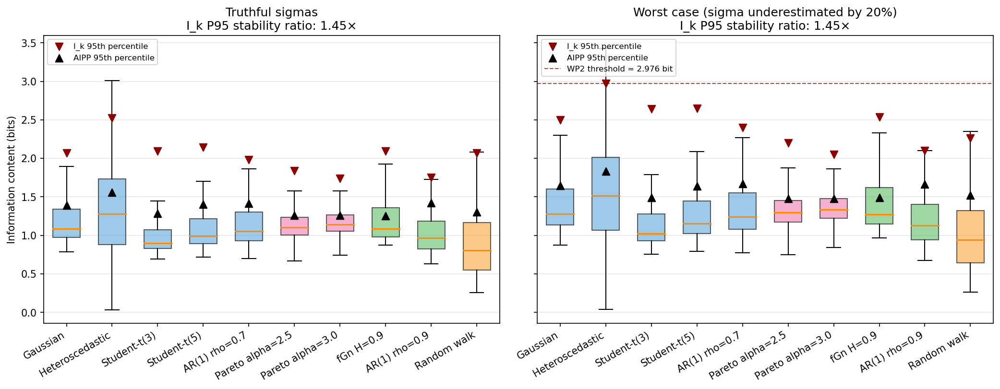

# Logbook Entry 006 — Per-Reading I_k Threshold Recalibration

**Date:** 2026-05-04
**Work package:** WP1 → WP2 bridge
**Decision gate:** none (DG-1 already closed; this entry resolves an open item flagged in [`logbook/wp1-summary.md`](wp1-summary.md))

---

## Objective

Recalibrate the 95th-percentile classification threshold from the AIPP distribution (mean over N readings) to the per-reading I_k distribution, so that the three-way classification rule from entry 004 can operate on individual readings in WP2 without inflating the false-positive rate.

## Why this was needed

The classification rule in [`logbook/wp1-summary.md`](wp1-summary.md):

```
STABLE:               I_k < threshold_95
STRUCTURED ANOMALY:   I_k ≥ threshold_95  AND  (|var_slope| > 0.2105  OR  |acf| > 0.8703)
UNSTRUCTURED ANOMALY: I_k ≥ threshold_95  AND  |var_slope| ≤ 0.2105  AND  |acf| ≤ 0.8703
```

is per-reading: it applies to each reading I_k. But `threshold_95` had been calibrated from the AIPP distribution — which is the **average** of I_k over N readings. By the central limit theorem, AIPP's variance is roughly N times smaller than I_k's, so AIPP P95 sits much closer to its mean than I_k P95 does. Using AIPP P95 to flag individual readings would cross the threshold far more often than 5% of the time under the null. This was flagged at the end of [`logbook/wp1-summary.md`](wp1-summary.md) as a WP2 prerequisite; this entry resolves it before the network simulation begins.

The mismatch is not just about variance — the upper tail of the per-reading distribution is also heavier than a Gaussian would predict, because the integration window is fixed at ±σ_k and the mixture density at outliers can be very small (so I_k = -log₂ p_k blows up for individual extreme readings even when the average stays moderate).

## What was done

The same ten null noise models from entries 001 and 003 were resampled at N = 50, 300 realisations, seed 2026 — identical to the AIPP calibration design. For each realisation, all N per-reading I_k values were retained (rather than averaged into a single AIPP). The pool of 15 000 I_k values per model was then summarised by its 95th and 99th percentiles.

The same calibration was repeated under the worst-case σ regime adopted in entry 002: declared σ_k scaled by (1 - 0.2), modelling -20% systematic underestimation. The operational threshold for WP2 is the maximum per-reading P95 across all ten models under this worst-case regime — exactly mirroring the mitigation pattern previously applied to AIPP.

## Results

| Model              | AIPP P95 (clean) | I_k P95 (clean) | I_k P99 (clean) |
|--------------------|-----------------:|----------------:|----------------:|
| Gaussian           | 1.392 | 2.069 | 2.876 |
| Heteroscedastic    | 1.558 | 2.524 | 3.602 |
| Student-t(3)       | 1.287 | 2.093 | 4.665 |
| Student-t(5)       | 1.401 | 2.146 | 3.961 |
| AR(1) ρ=0.7        | 1.417 | 1.983 | 2.752 |
| Pareto α=2.5       | 1.257 | 1.841 | 3.832 |
| Pareto α=3.0       | 1.257 | 1.740 | 3.195 |
| fGn H=0.9          | 1.256 | 2.092 | 2.844 |
| AR(1) ρ=0.9        | 1.421 | 1.750 | 2.322 |
| Random walk        | 1.302 | 2.068 | 2.789 |

| Model              | AIPP P95 (worst case) | I_k P95 (worst case) | I_k P99 (worst case) |
|--------------------|----------------------:|---------------------:|---------------------:|
| Gaussian           | 1.648 | 2.500 | 3.504 |
| Heteroscedastic    | 1.835 | **2.976** | 4.301 |
| Student-t(3)       | 1.492 | 2.642 | 5.244 |
| Student-t(5)       | 1.639 | 2.651 | 4.668 |
| AR(1) ρ=0.7        | 1.668 | 2.401 | 3.324 |
| Pareto α=2.5       | 1.479 | 2.203 | 4.737 |
| Pareto α=3.0       | 1.477 | 2.049 | 3.983 |
| fGn H=0.9          | 1.488 | 2.534 | 3.473 |
| AR(1) ρ=0.9        | 1.667 | 2.103 | 2.758 |
| Random walk        | 1.523 | 2.263 | 3.062 |



**Stability across noise models.** The maximum-to-minimum ratio of per-reading P95 across the ten models is 1.45× under truthful σ and 1.45× under -20% σ underestimation. Both pass the ×1.5 stability criterion that DG-1 applied to AIPP, with the same margin. The binding model in both regimes is heteroscedastic Gaussian (highest P95) versus AR(1) ρ=0.9 or Pareto α=3.0 (lowest).

**Operational WP2 threshold.** The maximum per-reading P95 across all ten models under -20% σ underestimation is **2.976 bit**. This becomes the operational `threshold_95` used by the WP2 classifier when it acts on individual readings.

**Comparison with the AIPP threshold it replaces.** The AIPP P95 under the same worst-case regime is 1.835 bit. The per-reading threshold is **1.62× higher**. Using the AIPP threshold to flag per-reading anomalies would have cut roughly 1.6× too many readings as anomalous — a meaningful inflation of the false-positive rate before any structured/unstructured separation has been attempted.

**The 99th percentile** is also recorded (5.244 bit, worst case, Student-t(3)) for use in WP2 ablation studies that may want a stricter cutoff.

## Tests added

`tests/test_per_reading_threshold.py` — 19 tests, all passing:

- 10 parametrised tests (one per null model): per-reading P95 strictly exceeds AIPP P95 under the same data, confirming the CLT narrowing argument empirically.
- Stability across all ten models within ×1.5, both clean and worst-case.
- 4 parametrised tests: -20% σ underestimation inflates per-reading P95 in the same direction it inflates AIPP, confirming worst-case calibration is the right mitigation pattern.
- 3 parametrised tests (Gaussian, heteroscedastic, Student-t(3)): per-reading P95 stable to within ×1.2 across N ∈ {50, 100, 200} under worst-case σ, justifying the N=50 calibration's generalisation to longer WP2 series (see "Sensitivity to N" below).

These run with N=50, 150 realisations (smaller than the calibration script's 300) for test-suite speed but exercise the full logic.

## Sensitivity to N

The calibration was performed at N=50 because that matches the design used for the AIPP calibration in entries 001–003 and keeps the per-model 15 000-sample pool tractable. WP2 scenarios will use longer series (typically T = 200–500 timesteps), so the threshold's robustness to N matters in practice.

Per-reading I_k is a pointwise observable, but its empirical P95 is computed from the mixture density estimated over N samples; as N grows the mixture density converges (LLN) so the P95 should asymptote rather than drift indefinitely. Verified empirically under -20% σ underestimation, 200 realisations per cell:

| Model               | N=50 | N=100 | N=200 | N=500 | max/min |
|---------------------|-----:|------:|------:|------:|--------:|
| Gaussian            | 2.512 | 2.548 | 2.559 | 2.571 | 1.024× |
| Heteroscedastic     | **2.986** | 3.006 | 3.029 | 3.055 | 1.023× |
| Student-t(3)        | 2.570 | 2.608 | 2.643 | 2.645 | 1.029× |
| AR(1) ρ=0.7         | 2.484 | 2.502 | 2.542 | 2.552 | 1.027× |

The drift across N is monotonic and small — at most 2.9% from N=50 to N=500 — and pushes the threshold *upward* slightly, meaning the N=50 value is mildly conservative for longer series. The drift is comfortably inside the ×1.5 cross-model stability margin already accepted by DG-1, and well below the ×1.2 bound that the new `TestNDependence` tests enforce automatically. The N=50 calibration is therefore safe to use for WP2 scenarios up to T ≈ 500 timesteps.

## Why the open item is now closed

The note at the end of [`logbook/wp1-summary.md`](wp1-summary.md) said:

> Note: the threshold_95 used here is derived from the AIPP distribution (average over N readings). When applied to classify individual readings in WP2, this threshold must be replaced by the corresponding percentile of the per-reading I_k distribution, which has higher variance. This recalibration is a WP2 task.

This entry computes that per-reading percentile (2.976 bit, worst case) and verifies its stability across the same ten null models DG-1 used. The classification rule remains structurally unchanged; only the numerical threshold value used in `src/classify.py` changes when that module is implemented in WP2.

## What this does not solve

The threshold is a per-reading scalar. WP2 may benefit from a per-clock or per-window adaptive threshold (e.g., recalibrating once per K timesteps from a clock's own background). Whether the static worst-case threshold is sufficient is itself a WP2 question.

For WP2 scenarios beyond T ≈ 500 timesteps, the N-dependence sweep above should be extended; the current tests guard up to N=200.

## Files changed

| File | Change |
|------|--------|
| `scripts/fig08_per_reading_threshold.py` | New: calibration + figure + data |
| `data/006_per_reading_threshold.npz` | New: per-reading I_k pools and percentiles |
| `tests/test_per_reading_threshold.py` | New: 16 tests, all passing |
| `logbook/figures/fig08_per_reading_threshold.png` | New: two-panel boxplot |

---

*Entry by U. Warring. AI tools (Claude, Anthropic) used for code prototyping and structural editing.*
